# 使用：
```bash
    git clone -b release https://gitee.com/wangbaolong36gmail/noqq.git  --depth=1
    cd noqq/bin
    # 修改config.hjson, 填入qq账号密码, 然后
    ./server.qqserver
    # 按照提示信息完成登录
    ./noqq*.AppImage
    

```

---


# 参与开发(electron，vue):

#### Build Setup
``` bash
    git clone -b master https://gitee.com/wangbaolong36gmail/noqq.git  --depth=1
    
    # 注意: 将static/dependencies.txt 的内容添至package.json的"dependencies"字段 
    # install dependencies
    npm install

    # install 结束，重新清空"dependencies"字段(否则下面的命令将执行失败)
    
    # serve with hot reload at localhost:9080
    npm run dev
    
    # build electron application for production
    npm run build


```

---

# Preview:
### 主界面
- 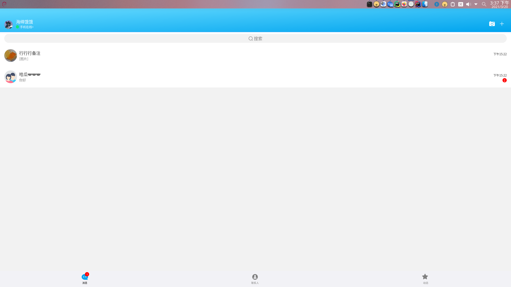
- 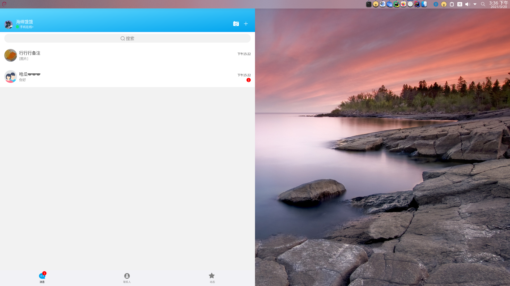
- 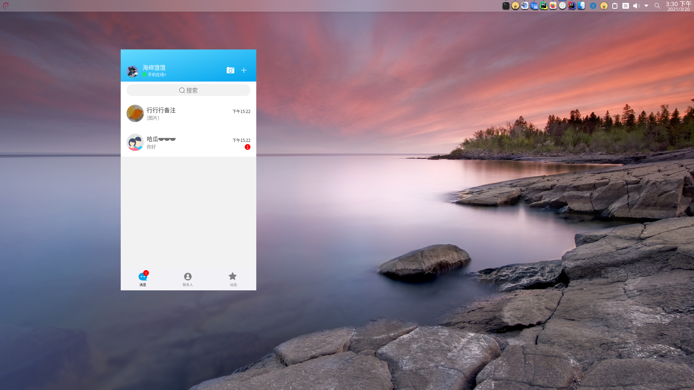
 
- 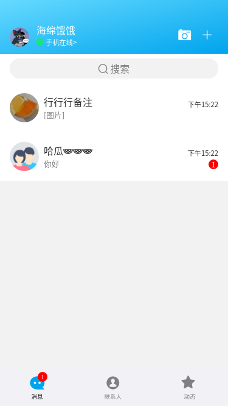
- 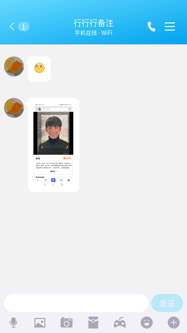
#### 图片预览
- 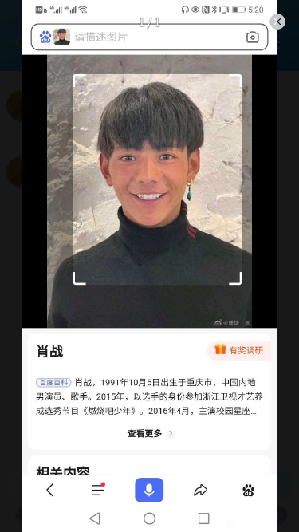
- 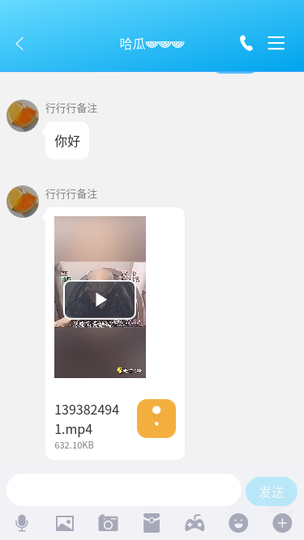

- 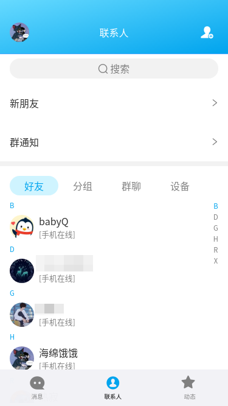
- 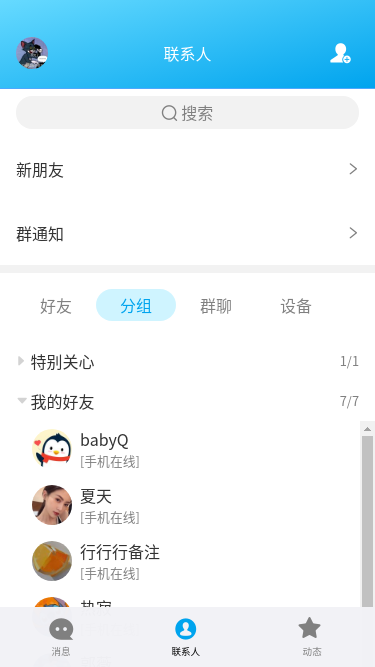
- 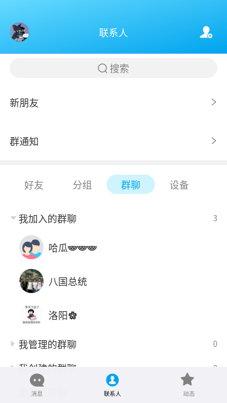
- 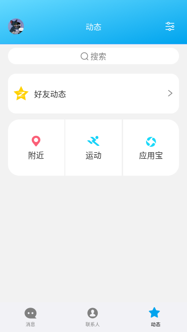

    
    
    


   
